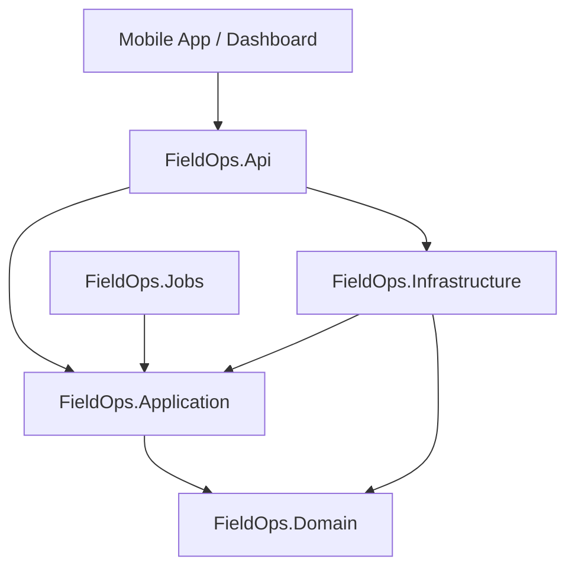
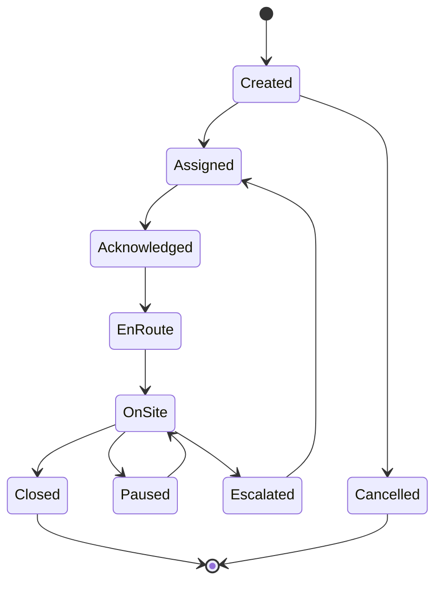

# FieldOps - Field Service Management System

FieldOps is a high-performance Field Service Management (FSM) platform built with .NET 8, designed to manage complex job lifecycles and enforce strict Service Level Agreements (SLA) for field technicians.

---

## 🏗️ Architecture

The system follows **Clean Architecture** principles, ensuring a clear separation of concerns and a focus on core domain logic.



### Core Components
- **FieldOps.Domain**: Contains the core domain model (Entities, Enums, Value Objects) and strict State Machines for data integrity.
- **FieldOps.Application**: Implements the Command Query Responsibility Segregation (CQRS) pattern using MediatR.
- **FieldOps.Infrastructure**: Handles persistence (EF Core SQL Server), real-time notifications (SignalR), and SLA calculations.
- **FieldOps.Api**: Provides versioned RESTful endpoints and real-time Hubs.

---

## 🚦 Job Lifecycle

The system enforces a strict state machine for job transitions to ensure accurate reporting and SLA tracking.



---

## ⏱️ SLA Management

FieldOps features a proactive SLA engine that calculates two critical timestamps upon job creation:
- **Response Deadline**: Minutes until the job must be acknowledged.
- **Resolution Deadline**: Minutes until the job must be closed.

**Proactive Escalation**: The system automatically triggers escalation alerts when a job reaches **75%** of its resolution threshold without being closed.

---

## 🛠️ Tech Stack

- **Framework**: .NET 8.0
- **Database**: SQL Server / Entity Framework Core
- **Real-time**: ASP.NET Core SignalR
- **Messaging**: MediatR (CQRS)
- **Validation**: FluentValidation
- **Testing**: xUnit / Moq

---

## 🚀 Getting Started

### Prerequisites
- .NET 8.0 SDK
- SQL Server (or LocalDB)

### Build and Run
1. **Clone the repository**:
   ```bash
   git clone https://github.com/your-repo/FieldOps.git
   ```
2. **Navigate to the solution folder**:
   ```bash
   cd FieldOps
   ```
3. **Build the solution**:
   ```bash
   dotnet build
   ```
4. **Run the API**:
   ```bash
   dotnet run --project src/FieldOps.Api
   ```

### Running Tests
Execute the unit tests to verify the core business logic:
```bash
dotnet test tests/FieldOps.UnitTests
```
